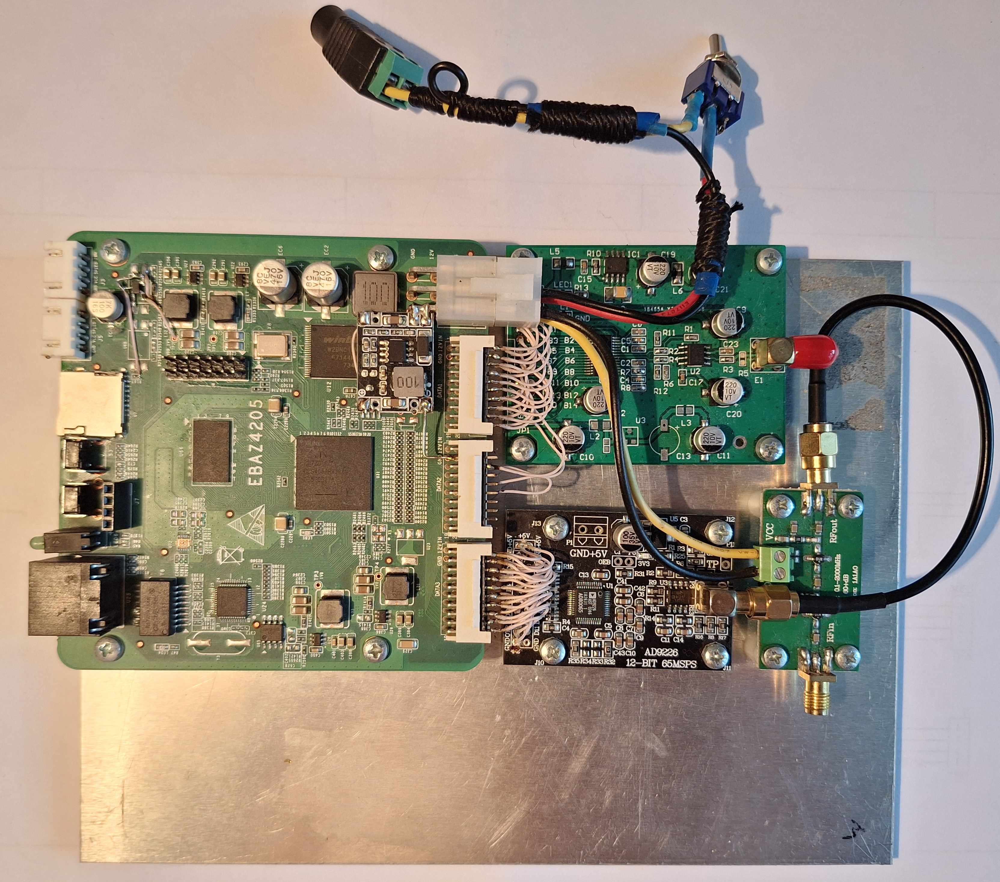

# ebaz4205-sdr

SDR 0–30 MHz built on the EBAZ4205 board with the AD9226 ADC and
DAC904 DAC chips. Inspired by the article
[Self-built SDR receiver on Zynq](https://habr.com/ru/articles/898490/) (Russian).



## What this is

Software-defined radio receiver running on an EBAZ4205 (Zynq-7010) board
with an AD9226 12-bit 65 MSPS ADC daughter card and an optional
DAC904 14-bit DAC daughter card. The FPGA fabric (PL) runs the DDC at
60 MSPS — NCO mixer → 5-stage CIC → 63-tap halfband FIR — decimating
to 1 MS/s I/Q. The ARM side (PS, bare-metal + FreeRTOS + lwIP) ships
the I/Q stream over TCP on port 1234 in SDRangel's `RemoteTCPInput`
wire format.

## Build & run

```bash
# FPGA bitstream
cd hardware/scripts
vivado -mode batch -source run_synth_impl.tcl
vivado -mode batch -source export_xsa.tcl

# Firmware
make -C firmware/vitis_ws/sdr_app/Release

# Pack BOOT.bin for SD-card boot
cd firmware/sd_boot
bootgen -arch zynq -image boot.bif -o BOOT.bin -w on
```

Copy `BOOT.bin` to a FAT32-formatted SD card, set the EBAZ4205 boot
mode to SD, power on. The board claims static IP `192.168.2.100`.
UART1 (MIO 24/25, 115200 baud) prints status and `[dbg]` lines.

In SDRangel, add a `RemoteTCPInput` device pointed at
`192.168.2.100:1234`. Boot default is 7.1 MHz centre @ 1 MS/s I/Q;
SDRangel's frequency / sample-rate controls retune the DDC live.

See [CLAUDE.md](CLAUDE.md) for architecture, AXI-Lite register map,
and bring-up notes.
